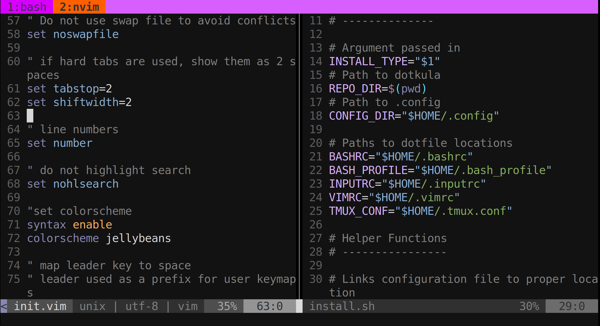

# Dotkula

My configuration files



## Installation

```bash
$ chmod +x install.sh # give file execute permission
$ ./install.sh <install-type>
```

Depending on what configurations you want to install,
use a different command for install-type. List of commands
are shown below

|install-type |configuration installed|
|---|---|
|ssh|bash + tmux + vim + nvim|
|bash|bash|
|vim|vim + nvim|
|tmux|tmux|
|alacritty|alacritty|
|all|bash + tmux + vim + nvim + alacritty|

## List of Program Configurations
- bash
	-.bashrc
	-.bash_profile
	-.inputrc
- tmux
	-.tmux.conf
- vim
	-.vimrc
- neovim
	-init.vim
-alacritty
	-alacritty.yml


